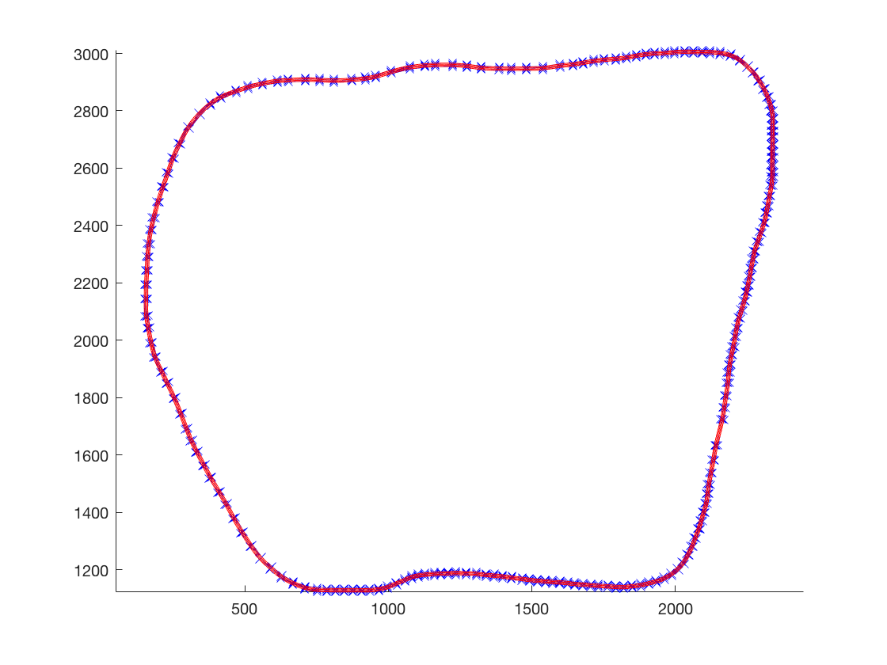
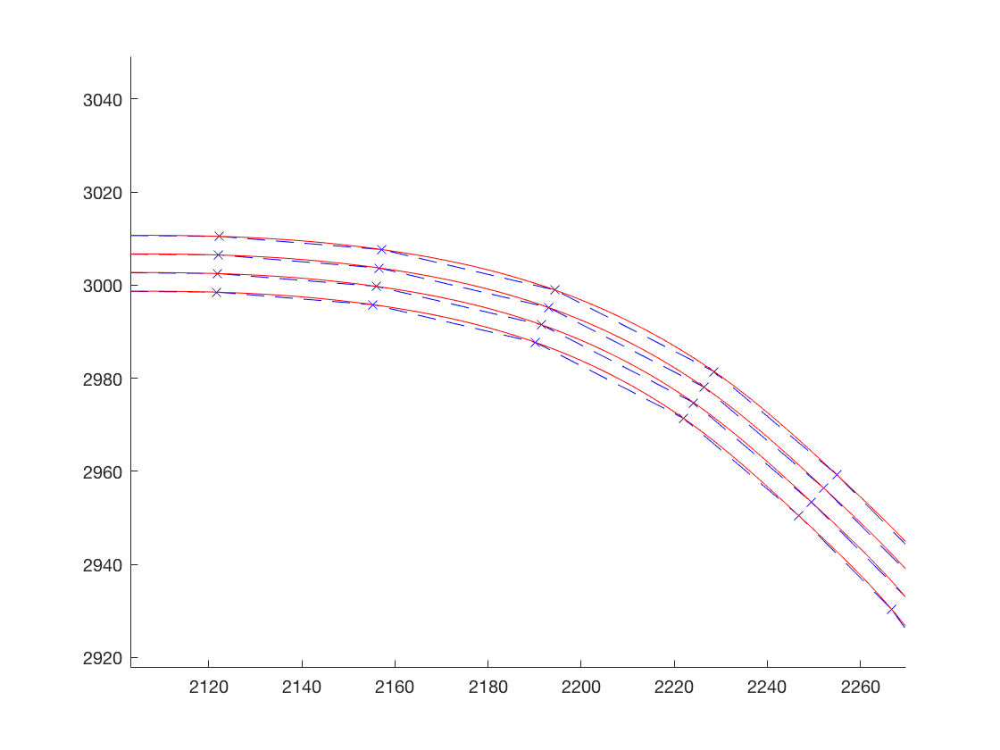

# CarND-Path-Planning-Project
Self-Driving Car Engineer Nanodegree Program
   
### Simulator.
You can download the Term3 Simulator which contains the Path Planning Project from the [releases tab (https://github.com/udacity/self-driving-car-sim/releases/tag/T3_v1.2).

### Goals
In this project your goal is to safely navigate around a virtual highway with other traffic that is driving +-10 MPH of the 50 MPH speed limit. You will be provided the car's localization and sensor fusion data, there is also a sparse map list of waypoints around the highway. The car should try to go as close as possible to the 50 MPH speed limit, which means passing slower traffic when possible, note that other cars will try to change lanes too. The car should avoid hitting other cars at all cost as well as driving inside of the marked road lanes at all times, unless going from one lane to another. The car should be able to make one complete loop around the 6946m highway. Since the car is trying to go 50 MPH, it should take a little over 5 minutes to complete 1 loop. Also the car should not experience total acceleration over 10 m/s^2 and jerk that is greater than 10 m/s^3.

#### The map of the highway is in data/highway_map.txt
Each waypoint in the list contains  [x,y,s,dx,dy] values. x and y are the waypoint's map coordinate position, the s value is the distance along the road to get to that waypoint in meters, the dx and dy values define the unit normal vector pointing outward of the highway loop.

The highway's waypoints loop around so the frenet s value, distance along the road, goes from 0 to 6945.554.

## Basic Build Instructions

1. Clone this repo.
2. Make a build directory: `mkdir build && cd build`
3. Compile: `cmake .. && make`
4. Run it: `./path_planning`.

Here is the data provided from the Simulator to the C++ Program

#### Main car's localization Data (No Noise)

["x"] The car's x position in map coordinates

["y"] The car's y position in map coordinates

["s"] The car's s position in frenet coordinates

["d"] The car's d position in frenet coordinates

["yaw"] The car's yaw angle in the map

["speed"] The car's speed in MPH

#### Previous path data given to the Planner

//Note: Return the previous list but with processed points removed, can be a nice tool to show how far along
the path has processed since last time. 

["previous_path_x"] The previous list of x points previously given to the simulator

["previous_path_y"] The previous list of y points previously given to the simulator

#### Previous path's end s and d values 

["end_path_s"] The previous list's last point's frenet s value

["end_path_d"] The previous list's last point's frenet d value

#### Sensor Fusion Data, a list of all other car's attributes on the same side of the road. (No Noise)

["sensor_fusion"] A 2d vector of cars and then that car's [car's unique ID, car's x position in map coordinates, car's y position in map coordinates, car's x velocity in m/s, car's y velocity in m/s, car's s position in frenet coordinates, car's d position in frenet coordinates. 

## Details

1. The car uses a perfect controller and will visit every (x,y) point it recieves in the list every .02 seconds. The units for the (x,y) points are in meters and the spacing of the points determines the speed of the car. The vector going from a point to the next point in the list dictates the angle of the car. Acceleration both in the tangential and normal directions is measured along with the jerk, the rate of change of total Acceleration. The (x,y) point paths that the planner recieves should not have a total acceleration that goes over 10 m/s^2, also the jerk should not go over 50 m/s^3. (NOTE: As this is BETA, these requirements might change. Also currently jerk is over a .02 second interval, it would probably be better to average total acceleration over 1 second and measure jerk from that.

2. There will be some latency between the simulator running and the path planner returning a path, with optimized code usually its not very long maybe just 1-3 time steps. During this delay the simulator will continue using points that it was last given, because of this its a good idea to store the last points you have used so you can have a smooth transition. previous_path_x, and previous_path_y can be helpful for this transition since they show the last points given to the simulator controller with the processed points already removed. You would either return a path that extends this previous path or make sure to create a new path that has a smooth transition with this last path.

## Tips

A really helpful resource for doing this project and creating smooth trajectories was using http://kluge.in-chemnitz.de/opensource/spline/, the spline function is in a single hearder file is really easy to use.

---
## Model Documentation

### Map Class
The given csv file contains only 181 points, the highway map is defined by connecting the points with line segments. Thus the highway map is very coarse which will cause sudden orientation change at those points. Therefore, to get a better map with higher precision, I decided to use the `spline` library provided in the 'Tip' section to connect those points. Four splines are constructed in the [constructor of Map class](https://github.com/xu13/CarND-Path-Planning-Project/blob/d6458b1046bf0d47be8f0ad95234f1d682d44769/src/map.cpp#L3). To get the x/y coordinates from the Frenet coordinates, I can simply do

```c++
std::vector<double> Map::getXY(const double s, double d) const
{
  double s1 = std::fmod(s, MAX_S);
  double x = s_x_(s1);
  double y = s_y_(s1);
  double dx = s_dx_(s1);
  double dy = s_dy_(s1);
  return {x + d * dx, y + d * dy};
}
```

To compare with the original map, I created a `map_test` executable to write the high precision map into a csv file with interval `s=1`. I also created a Matlab script to visualize both map. The result is shown in



A closer look at the top right (a sharp left turn) can show the improvement. The blue crosses are the points in the original csv file, the blue dashed line is the original map using line segments, whereas the red solid line is what I have.



**Note: now I have a better map to use, however I believe the incident checking in the simulator uses the coarse map for determining if the vehicle is outside the lane bound. As a result, there could be occasional out of right lane bound incidents happening, which I believe is a false alarm.**

### Car Class

Car class is created for storing the car information and the state information. I explicitly save the previous trajectory to be used for the next planning cycle. This is because the "previous_path_x" and "previous_path_y" returned by the simulator doesn't contain Frenet coordinates, and we don't want to convert back from cartesian coordinates. We can do this because a perfect controller is used to follow the trajectory.

### Object Class

Object class is used to store the surrounding vehicles' information provided by the simulator.

### Trajectory Class

A trajectory contains multiple (in my case N=50) waypoints. The waypoint class is created to save the waypoint information. The trajectory class is simply a wrapper of `std::vector<Waypoint>`.

### Planner Class

The planner class is the core of this project. The constructor takes in the pointers to the map and the ego vehicle: `Planner(Map* map, Car* car)`. The public function [plan](https://github.com/xu13/CarND-Path-Planning-Project/blob/d6458b1046bf0d47be8f0ad95234f1d682d44769/src/planner.cpp#L9) defined as

```c++
void plan(const std::unordered_map<int, Object>& objects, const size_t leftover_size, std::vector<double>* next_x_vals, std::vector<double>* next_y_vals) const;
```

takes the objects (surrounding vehicles) information `objects`, number of leftover waypoints from previous plan cycle `leftover_size`, and generates a trajectory and assigning the cartesian coordinates of the waypoints to `next_x_vals` and `next_y_vals`.

For trajectory generation, I use the jerk minimization method provided in class and the reference paper by Werling et al. I provide trajectory generation for three cases, namely for velocity keeping, car following, and lane changing. I use quintic and quartic polynomial solver to solve for corresponding polynomial coefficients. Private functions are provided to retrieve waypoints from the solved polynomials.

To determine which behavior to generate trajectory for at the next planning cycle, I use a simple state machine containing four behaviors defined in `car.h`

```c++
enum State {
  VELOCITY_KEEPING = 0,
  FOLLOWING,
  CHANGE_LANE_LEFT,
  CHANGE_LANE_RIGHT,
  NUM_OF_STATES
};
```

I check the surrounding vehicle states (namely the states of front car on the same lane, front/rear cars on the left/right lane) to determine the next state. When there is no vehicle ahead of me in the same lane, I just keep the speed a bit under the `SPEED_LIMIT`. If there is a leading vehicle within 30 meters, I follow that car. At the mean time, I check if there is enough gap in the adjacent lane, I change lane. After changing lane, I set the mode back to `VELOCITY_KEEPING`.

---

## Dependencies

* cmake >= 3.5
  * All OSes: [click here for installation instructions](https://cmake.org/install/)
* make >= 4.1
  * Linux: make is installed by default on most Linux distros
  * Mac: [install Xcode command line tools to get make](https://developer.apple.com/xcode/features/)
  * Windows: [Click here for installation instructions](http://gnuwin32.sourceforge.net/packages/make.htm)
* gcc/g++ >= 5.4
  * Linux: gcc / g++ is installed by default on most Linux distros
  * Mac: same deal as make - [install Xcode command line tools]((https://developer.apple.com/xcode/features/)
  * Windows: recommend using [MinGW](http://www.mingw.org/)
* [uWebSockets](https://github.com/uWebSockets/uWebSockets)
  * Run either `install-mac.sh` or `install-ubuntu.sh`.
  * If you install from source, checkout to commit `e94b6e1`, i.e.
    ```
    git clone https://github.com/uWebSockets/uWebSockets 
    cd uWebSockets
    git checkout e94b6e1
    ```

## Editor Settings

We've purposefully kept editor configuration files out of this repo in order to
keep it as simple and environment agnostic as possible. However, we recommend
using the following settings:

* indent using spaces
* set tab width to 2 spaces (keeps the matrices in source code aligned)

## Code Style

Please (do your best to) stick to [Google's C++ style guide](https://google.github.io/styleguide/cppguide.html).

## Project Instructions and Rubric

Note: regardless of the changes you make, your project must be buildable using
cmake and make!


## Call for IDE Profiles Pull Requests

Help your fellow students!

We decided to create Makefiles with cmake to keep this project as platform
agnostic as possible. Similarly, we omitted IDE profiles in order to ensure
that students don't feel pressured to use one IDE or another.

However! I'd love to help people get up and running with their IDEs of choice.
If you've created a profile for an IDE that you think other students would
appreciate, we'd love to have you add the requisite profile files and
instructions to ide_profiles/. For example if you wanted to add a VS Code
profile, you'd add:

* /ide_profiles/vscode/.vscode
* /ide_profiles/vscode/README.md

The README should explain what the profile does, how to take advantage of it,
and how to install it.

Frankly, I've never been involved in a project with multiple IDE profiles
before. I believe the best way to handle this would be to keep them out of the
repo root to avoid clutter. My expectation is that most profiles will include
instructions to copy files to a new location to get picked up by the IDE, but
that's just a guess.

One last note here: regardless of the IDE used, every submitted project must
still be compilable with cmake and make./

## How to write a README
A well written README file can enhance your project and portfolio.  Develop your abilities to create professional README files by completing [this free course](https://www.udacity.com/course/writing-readmes--ud777).

